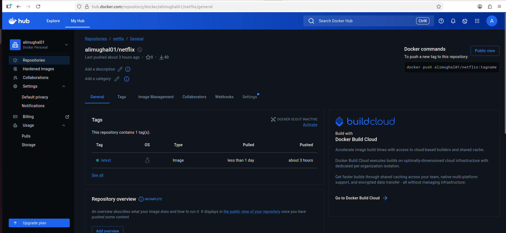
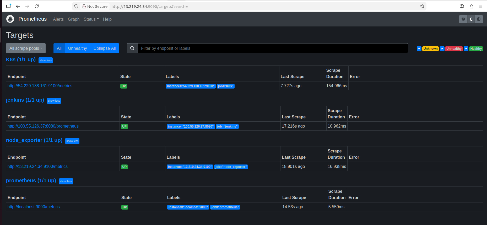
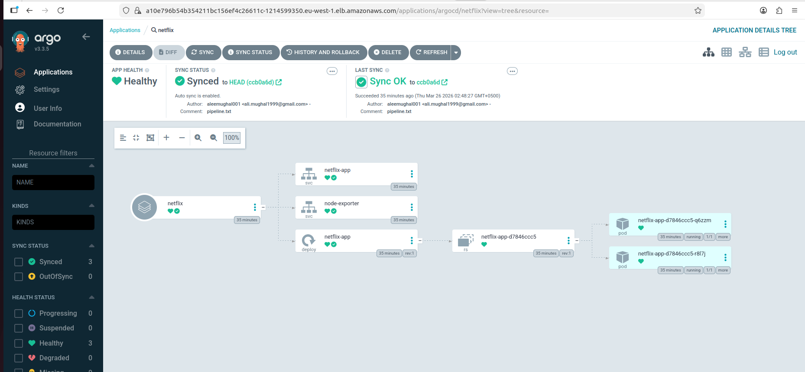
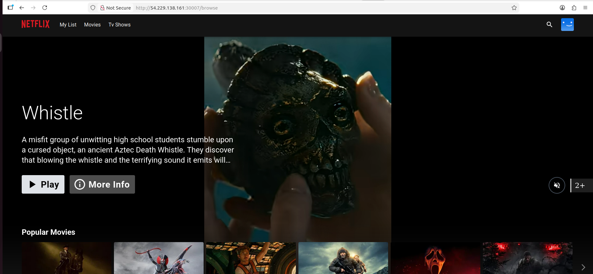

## 📸 Project Screenshots

### Docker Hub Repository


### Prometheus Targets


### ArgoCD Deployment


### Application UI


# Deploy Netflix Clone on Cloud using Jenkins - DevSecOps Project

This project demonstrates a complete DevSecOps workflow for deploying a Netflix clone using Jenkins, Docker, SonarQube, Trivy, Prometheus, Grafana, and Kubernetes.

---

## 🚀 Project Overview

This project covers:

- Deploying a Netflix clone application on AWS EC2
- Containerizing the application with Docker
- Running code quality and security scans with SonarQube, OWASP Dependency-Check, and Trivy
- Building a CI/CD pipeline with Jenkins
- Monitoring the application with Prometheus and Grafana
- Deploying workloads to Kubernetes
- Managing Kubernetes delivery with ArgoCD

---

## 🛠️ Tech Stack

- AWS EC2
- Docker
- Jenkins
- SonarQube
- OWASP Dependency-Check
- Trivy
- Prometheus
- Grafana
- Kubernetes
- ArgoCD
- React
- Vite

---

## 📂 Clone the Repository

```bash
git clone https://github.com/aleemughal001/Netflix-DevSecOps-Project.git
cd Netflix-DevSecOps-Project
